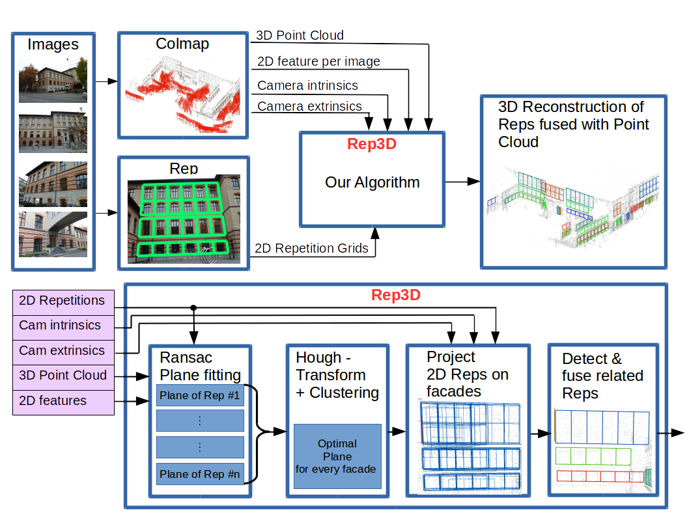
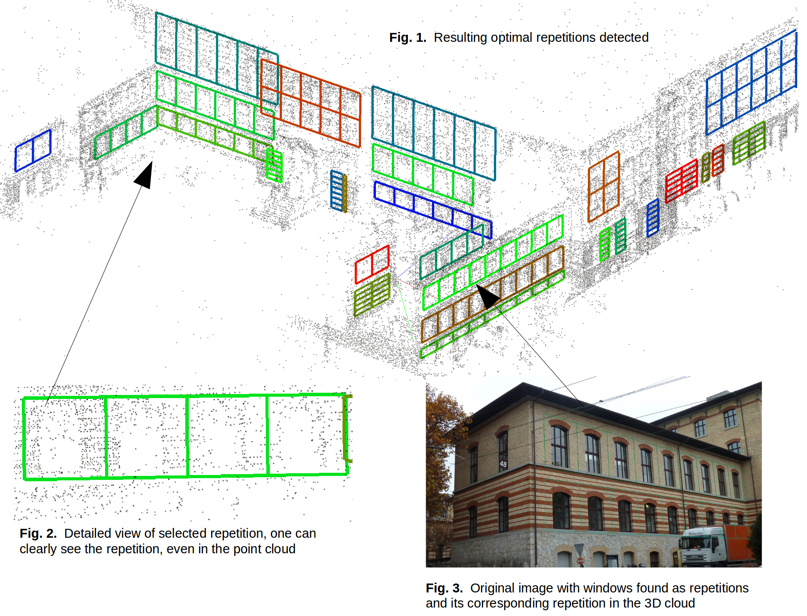

# About
This project was conducted within the scope of the 3D Vision course at [ETHZ](http://www.ethz.ch), offered by the [CVG](http://www.cvg.ethz.ch/) Group.
It is a collaboration between [pascalenderli](https://github.com/pascalenderli), [lfrschkn](https://github.com/lfrschkn), [tmarv](https://github.com/tmarv)

# Motivation
Applications like scene modeling, autonomous navigation and virtual tourism make use of sparse point clouds obtained via Structure-from-Motion. Often these applications require new images to be localized within the preceding point cloud. In the presence of repetitive structures (e.g. windows, cladding, panels) this task becomes very difficult, since the localization might be ambiguous. Augmenting the point cloud with information on repetitive structures has two potential benefits. First the information could be used to rectify and pack the sparse point cloud. Second knowing more about the appearance of repetitions in the point cloud might help subsequent localization steps to improve their performance.

# Problem Definition and Technical Details

There are four main problems to be solved of which the first two are already solved by previous work: 

1. Obtain a 3D reconstruction (we use [COLMAP](https://colmap.github.io/) by Johannes Schönberger)
2. Find repetitions on 2D images (we use [Single View Repetition Detection](http://ccwu.me/code.html) by Changchang Wu, proposed in ["Detecting large repetitive structures with salient boundaries"](https://link.springer.com/chapter/10.1007/978-3-642-15552-9_11))
3. Find 3D projection planes  (our contribution)
4. Project repetitions from 2D to 3D (our contribution)
5. Find optimal repetition representation in point cloud (our contribution)

To find the projection planes for point 3 and 4 we use corresponding features that lie within the repetitions in 2D and use RANSAC to fit the plane model. We then project every 2D repetition onto its corresponding plane in 3D, found before. This results in multiple overlapping repetitions in 3D. Then we use a Hough transform in combination with the DBSCAN algorithm to find the main planes (these correspond to the facades of the building). We then project the repetitions onto their corresponding facades. As a final step we cluster the repetitions on their main plane and find one optimal representation for each cluster. This is done by comparing overlap, cell width and height, corner closeness and the amount of columns and rows of a repetition scheme.

As a study case we use an image dataset of the CAB building at ETH Zurich.

# Pipeline

# Results and Discussion

Figure 1 shows the full reconstruction with the repetitions found using our pipeline. The resulting repetitions clearly fit to the repetitions, in figure 2 the repetitive pattern can even be clearly seen within the point cloud. Our Algorithm generally finds the biggest repetition scheme. As can be seen in figure 3, the windows are found without their sub divisions are found. Still this highly depends on the 2D repetitions found before, using the REP4 tool. As can be seen in figure 1  also smaller patterns are found at other locations.
It is further important to note that we use different parameters to tweak the criteria we use to determine an optimal representation. Our main trade off is between trusting given repetition schemes and complementing missing parts. These parameters would have to be adjusted for a different building.
Concerning performance the Rep3D algorithm took about 1 minute processing time with a sparse point cloud and 312 REP4 preprocessed images as input. The performance bottleneck is clearly the REP4 preprocessing which took about 6 hours for 312 images.

# Conclusion and Outlook

Our pipeline robustly projects found repetitions into 3D it rejects outliers and noise and only accepts valid repetitions. As proposed we were able to successfully integrate the existing tools and use their output to augment the point cloud with information on repeated structures.

Concerning further work we suggest to improve the REP4 tool both, in speed and in image handling because its output depends on the camera rotation which leads to problems in detecting and fusing related repetitions. 
Further work could also be done by trying to densify the point cloud. Since the repetitions cells are now available one could copy the points included in one cell to neighboring cells.

